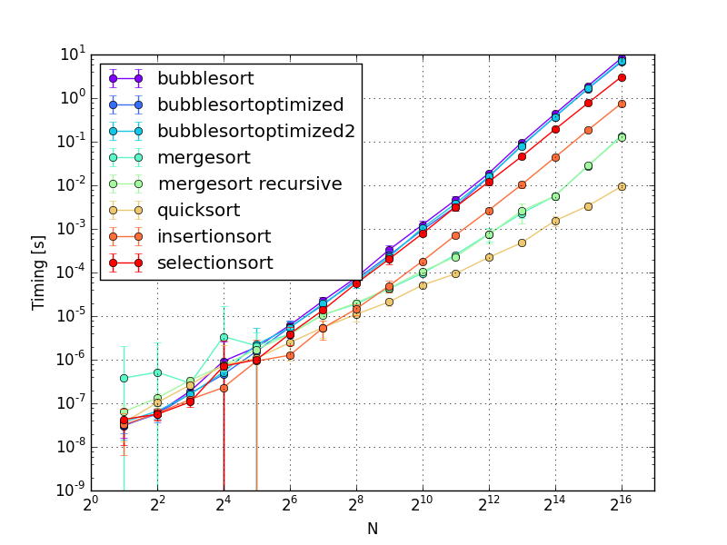

# sorting

This is a simple C++ template library implementing different sorting algorithms.

## Goal
The goal of this project is to learn different canonical sorting algorithms and
their implementations; it is purely educational. I did not research any optimization
on them and as such, there might be faster (but more complicated) ways of implementing
them. I did put some though in the implementations as to have efficient and clean
implementations without wasting memory.

The code should be well commented and simple to follow and/or expand.
Unit tests are used to validate every implementations.


## Algorithms
Sorting functions are encapsulated into namespaces.
Implemented algorithms are (more to come):
### Simple sorts
* Insertion sort (in place): *sorting::simple::InsertionSort()*
* Selection sort (in place): *sorting::simple::SelectionSort()*

### Efficient sorts
* Merge sort (in place, non-recursive, bottom-up): *sorting::efficient::MergeSort()*
* Merge sort (in place, recursive, top-down): *sorting::efficient::MergeSortRecursive()*
* Quicksort (in place, recursive): *sorting::efficient::Quicksort()*


## Usage
It's a template library, so just include it:

```C++
#include "sorting.h"
```

## Profiling

A profiling code measures the average and standard deviation duration of 6
runs over a range of N = 2^0 = 1 to N = 2^15 = 65,536. A python 3 script
will plot the data. Both are located in `profiling`.

Targets `prof` and `plot` have been added to the cmake file to compile
the profiling code, run it and plot the data. On a Mac Book Air 2014
(Intel(R) Core(TM) i7-4650U CPU @ 1.70GHz), the results are:

```bash
$ mkdir build
$ cd build
$ cmake ..
$ make prof
$ make plot
```



Note that the figure has error bars representing the standard deviation, which
are not apparent on a log plot. The scale can be toggle between regular and log
scale by pressing "l" from inside the matplotlib window.


## Notes
Values are either swapped (using *std::swap()*) or moved (using *memmove()*). One has to make
sure the array type used support these operations. Basic C++ types (integers, doubles, etc.) don't
have any problem.


## Testing
To validate the different implementations, unit tests are used. A copy of [gtest](https://code.google.com/p/googletest/)
(version 1.7.0, BSD license) is included.

To run all unit tests, use cmake:

```bash
$ cd sorting.git/build
$ cmake ..
$ make
$ ./unit_tests/libsorting_utests
```

As of now, 10 unit tests are run for each sorting algorithms:
- The first N elements (with N from -1 to 16) of an array of 16 integers is sorted;
- The first N elements (with N from -1 to 16) of an array of 16 doubles is sorted;
- An array of 16 integers is sorted and compared to the required result;
- An array of 16 doubles is sorted and compared to the required result;
- Arrays of N integers (with N from -1 to 100) with random values are sorted (current time as seed);
- Arrays of N doubles (with N from -1 to 100) with random values are sorted (current time as seed);
- Arrays of N integers (with N from -1 to 100) with values already sorted are sorted;
- Arrays of N doubles (with N from -1 to 100) with values already sorted are sorted;
- Arrays of N integers (with N from -1 to 100) with values (inversely) sorted are sorted;
- Arrays of N doubles (with N from -1 to 100) with values (inversely) sorted are sorted;

For each test, an array is considered sorted if:
- Every element is smaller or equal (<=) then its next neighbour in the array;
- All elements in the array to sort is present (using ==) in the sorted array;
- All elements in the sorted array is present (using ==) in the array to sort;
- No NaN is present in the sorted array;


## License

This code is distributed under the terms of the BSD 3 clause and is Copyright 2014 Nicolas Bigaouette.
